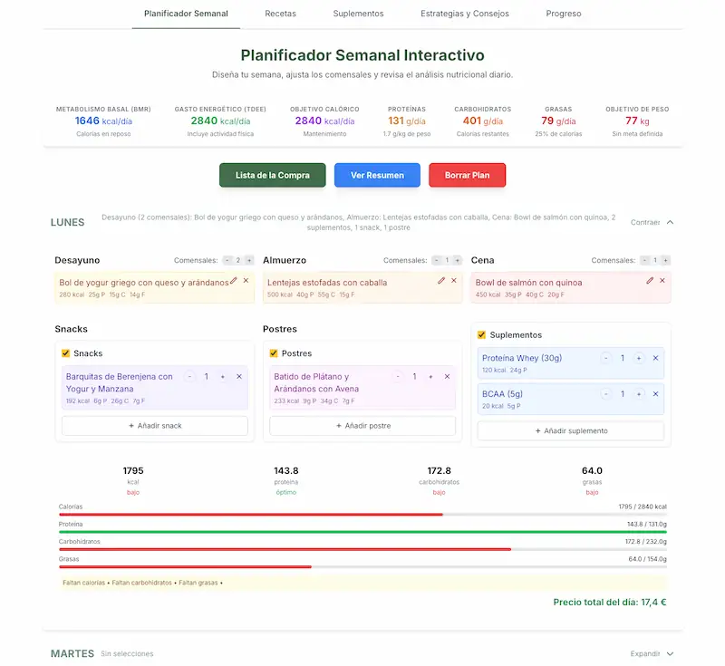

# 🍏 Planificador de Dieta ALPHA

Version de prueba
https://diet-planner-alpha.pages.dev/welcome/

 
 

**Planificador de dietas Alpha** es un prototipo funcional y una prueba de concepto para una aplicación web de planificación de dietas. Este proyecto sirvió como un campo de aprendizaje intensivo en la construcción de una aplicación full-stack moderna, integrando tecnologías como Astro, Preact, NanoStores y Supabase.

La versión actual está **archivada y completa en su fase alfa**. Ha cumplido su misión de validar las funcionalidades principales y proporcionar una base de conocimiento sólida para su futura reconstrucción profesional.

## 🚀 Características Implementadas (v0.1)

#### Gestión de Usuario y Datos

- 🔐 **Autenticación Completa:** Sistema unificado con OAuth (Google, GitHub) y email/contraseña a través de Supabase Auth.
- 🗄️ **Base de Datos en la Nube:** Gestión de datos centralizada en Supabase (PostgreSQL).
- 🔄 **Adaptador Híbrido de Datos:** Sincronización con Supabase y fallback inteligente a datos locales para funcionamiento offline.
- 🗑️ **Eliminación Segura de Cuenta:** Gestión completa del ciclo de vida del usuario.

#### Planificación y Análisis

- 📅 **Planificador Semanal Interactivo:** Interfaz para organizar comidas diarias.
- 📊 **Seguimiento de Macronutrientes:** Cálculo y visualización de la ingesta de calorías, proteínas, grasas y carbohidratos.
- 📈 **Gráficos de Progreso:** Visualización del histórico de peso contra objetivos con Chart.js.
- 🎯 **Gestión de Objetivos:** Creación y edición de metas de peso personalizadas.
- 🛠️ **Panel de Administración:** Interfaz para gestionar la base de datos de comidas y suplementos.

## ✈️ El Viaje del Proyecto y Estado Actual

Este proyecto nació como un prototipo de desarrollo rápido para explorar una idea. Durante este proceso, se implementó una cantidad significativa de funcionalidades complejas, incluyendo la autenticación completa y una migración a una arquitectura de base de datos en la nube.

Esta fase inicial ha sido un **éxito rotundo en términos de aprendizaje**, revelando la importancia de una arquitectura de software planificada y un diseño previo para la escalabilidad a largo plazo.

Por ello, con los objetivos de aprendizaje cumplidos, **esta versión alfa (v0.1) se considera finalizada y archivada**. El código permanece como testimonio del prototipo funcional.

## 💡 Próximos Pasos: El Renacimiento con Vue.js

El conocimiento adquirido en esta alfa es la base para la siguiente fase: una **reconstrucción completa del proyecto desde cero**. La nueva versión se desarrollará siguiendo las mejores prácticas de la industria:

1.  **Diseño UX/UI Previo en Figma:** Creación de un diseño visual y de experiencia de usuario sólido, con un pequeño branding.
2.  **Arquitectura Planificada:** Diseño de una arquitectura de front-end y back-end robusta y escalable.
3.  **Nuevo Stack Tecnológico:** Reconstrucción con **Vue.js** para aprovechar su ecosistema y reactividad, que me ayude a aprender un nuevo lenguaje.
4.  **Desarrollo Orientado a Componentes y Tests.**

## 🛠️ Stack Tecnológico (v0.1)

- **Framework**: Astro 5.9
- **UI**: Tailwind CSS 3.4
- **Componentes**: Preact 10.26
- **Base de Datos**: Supabase (PostgreSQL)
- **Autenticación**: Supabase Auth (OAuth + Email/Password)
- **Gestión de Estado**: NanoStores
- **Gráficos**: Chart.js 4.4
- **Tipado**: TypeScript
- **Ejecución de Scripts**: tsx
- **Formateo de Código**: Prettier + ESLint

---

Desarrollado con ❤️ e por Samu Lo | [@samuhlo](https://github.com/samuhlo)
